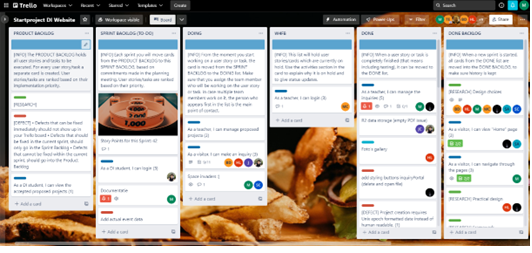
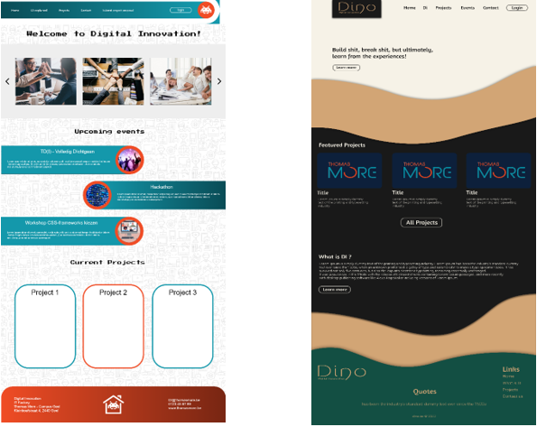
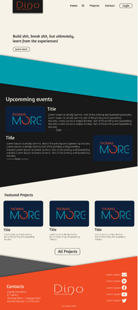

# DI-009 De website 

## Word in advance
For this class project, 2DI was tasked with creating a Digital Innovation website. This website has to serve DI students, other ITF students that being mainly first year students and external groups like companies.

Each group has a different use case for the website. 

DI students will use it as a central hub for uploading finished projects. First year students can use it to get better acquainted with Digital Innovation and ask questions. 
Finally companies can use the website to propose projects to DI

**Deadline :** Wendnesday October 12th at 8pm

---

## 1 Requirements analysis
### 1.1	What and why? 
Requirements analysis is a engineering and software system that focuses on finding the needs and conditions the client wants. 
To make this easier a UDC is used.

A Use Case Diagram or for short a UCD is an overview that shows various functionalities also called use cases and different types of system users called actors. Within a UCD, the use cases are represented as circles or ellipses while the actors are represented as stick man icons. 
A Use Case Diagram is often used in requirements analysis in order to get a clear view of what the client is expecting and to give a simple diagram to possible developers of the system.

### 1.2	The requirements
 * Home page
    * With featured projects
    * Upcoming events 
 * What is DI page
    * General information about DI
    * Day in the life of a DINO
    * Gallery (pictures, video's, etc.)
 * Project page
    * With all the old and newly uploaded projects
    * Filter projects
 * Upload new project page
    * Upload a new project  -> converted into equal styled tiles
    * Access only for DINO students
 * Contact page
    * 1ITF basic information
    * Company information (upload form?)

### 1.3	Use case diagram

After we had our requirements, these have been listed above at 1.2 The requirements. We created our use case diagram.

### 1.4 Trello

Once we had our use case diagram, we started working on our Trello board.
Trello is web-based, list-making application that is often used in combination with a use case diagram. 
On this board you will see all kinds of different cards, these cards are your uses stories also known as your use cases, you can view this on Figure 2 : Trello board. 
The board uses a to-do, doing, done workflow making it very easy for everyone within the team to know what each member is doing, things members are struggling with, etc.

---

## 2 Front-end decisions
Before we could start building the website some important decisions had to be made. For example what framework would we use? Which plugins did we need? How is the website going to look like?

Many questions that had to be answered before we could write a single line of code.

### 2.1 Framework
For the framework we had a couple of options, we’ll list some of them below:
* Hugo 
    * Advantages : fastest HTML5 renderer, no third party plugins needed
    * Written in GO 
        * Powerful content management system
        * Convert markdown into HTML
        * GoTemplats 
    * Some features : syntax highlighting, image processing, internationalization, short codes
* Ruby 
    * Advantages: simplicity, code readability, minimal syntax
    * Easy to use like Python but with OO features
    * OO oriented
        * Everything is an object
        * Every object can be modified
    * Ruby gem package manager to share code between developers
        * Program organized self contained format called GEM 
* Gatsby
    * Advantages: prefetching, performance, no server/database/load balancers, scales to traffic spikes
    * React based 
    * Plugin eco system
    * Gatsby cloud -> Netlify
* **Next.js**
    * Advantages: server-side rendering, speed and performance, 
    * React based
    * Focuses on both fully rendered content for both whiles being highly interactive content for users 
    * Uses React components  file structure that mirrors actual URL’s that the user will navigate to

In the end we decided on using **Next.js** because it would best suit our needs and there were some team members that had had previous experience using Next.js.

### 2.2	CSS framework
This decision was very quickly made with no real other options.
Almost everyone unanimously decided on using Tailwind CSS after a team member showed a quick demo of how it works.
Tailwind CSS is a massive collection of CSS classes that can be quickly used without the need of writing semantic css yourself. It removes the need for writing CSS classes yourself and gives a massive assortment of classes that you can use

### 2.3 design

When it came to design we had two team member that took it upon themselves to create a design for how the website should look.
Both designs came out great and after a quick consultation with the product owner it was decided to mix the two together creating a unique and outstanding design.
Since we need to be associated with Tomas More we had to change Nick’s coffee like design BUT that does not mean it was forgotten … 

---

## 3 Back-end decisions
### 3.1 ... 
### 3.2 ... 
### 3.3 ... 

## 4 The result and conclusion
You can view the project result at : **[digitalinnovation.be](https://digitalinnovation.be/)**

In conclusion we think we can say that it was a rather challenging project.
From getting used to the working agile to getting stuck on many error 418 I'm a teapot’s. The project certainly didn’t go without some needed bumps. 
Though in the end we think we can be proud at the result of the website.
All needed functions are there with some extra’s for those who can find them. 

